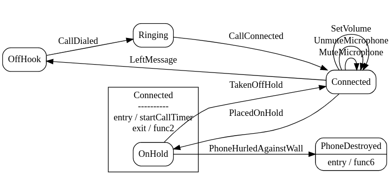

# Phone states



This project demonstrates the use of [stateless](https://github.com/qmuntal/stateless), an implementation of state machines in Go.

This is a modified version of the original [example](https://github.com/qmuntal/stateless/blob/master/example_test.go) which uses an external storage for storing the states.

```go
type LogRepository struct {
    ...
    phoneLogs map[PhoneID][]Log
}
```

This is a very simple in-memory store. But in reality, this external storage can be a real database (e.g. Postgres, MariaDB, etc.)

## Running

To run the example just run the command below:
` $ go build -v -o phonestates && ./phonestates `
